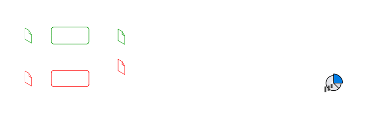
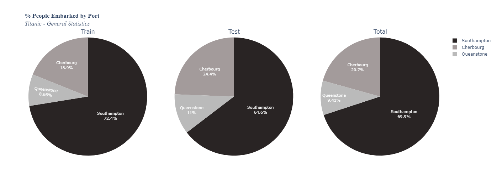
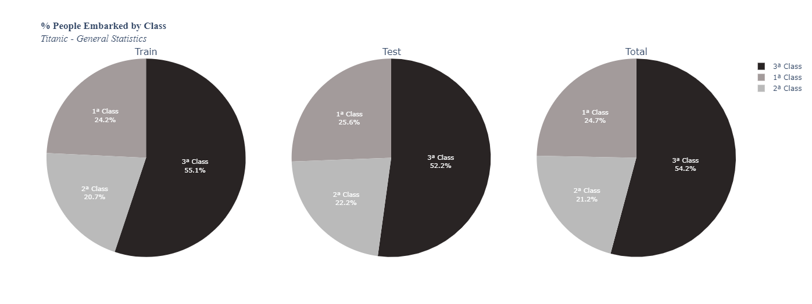
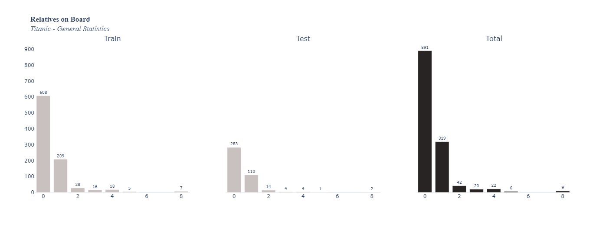
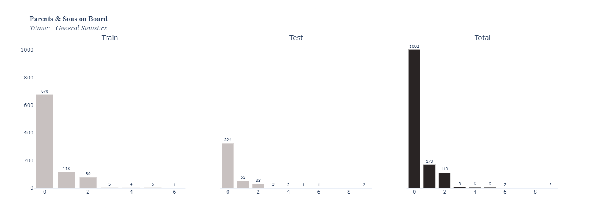
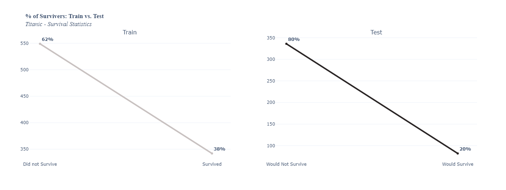
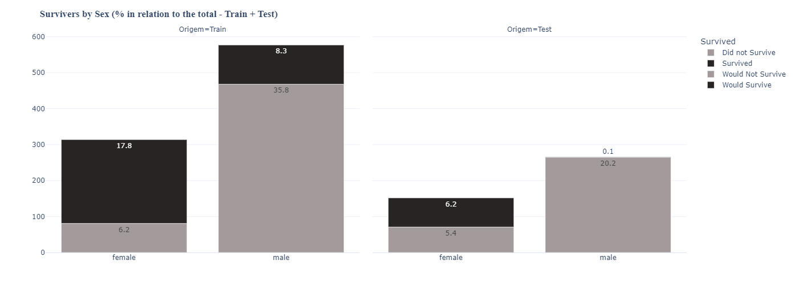
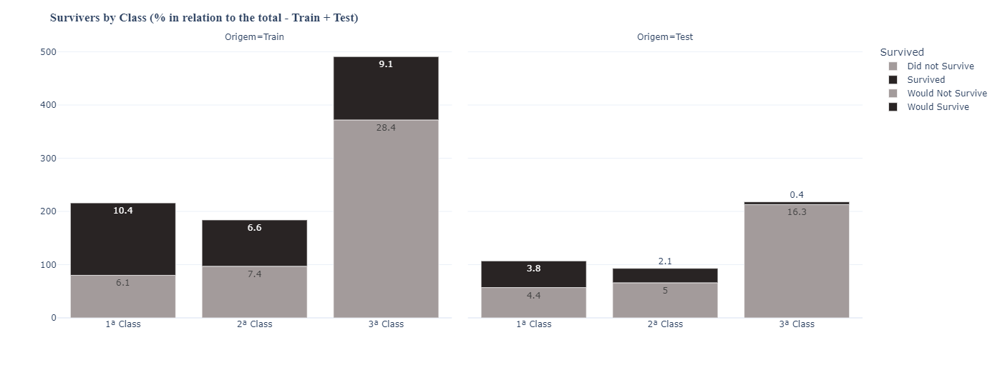
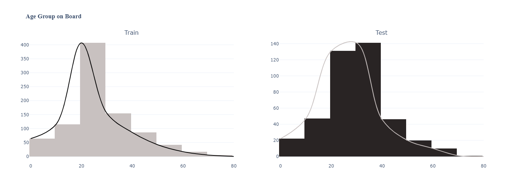

# Reviewing The Classic Kaggle Dataset
Practicing data visualization and manipulation with Plotly and Pandas

Scenario:
1. Receive two datasets (train and test) in different .csv files;
2. An estimated logit model to apply in the test set and predict the test values;
3. Unite these two datasets into a final merged dataset as a new .csv file;
4. Create dashboards (with python) using ONLY bar, line and pie charts (in real life we face many restrictions);
5. The graphs should compare the variables for both datasets (train and test);

Estimated Logit Model:

*When plotted in the jupyter notebook, they are plotted together (no blank spaces between them), simulating a "panel"*
## General Statistics

## Survival Statistics

